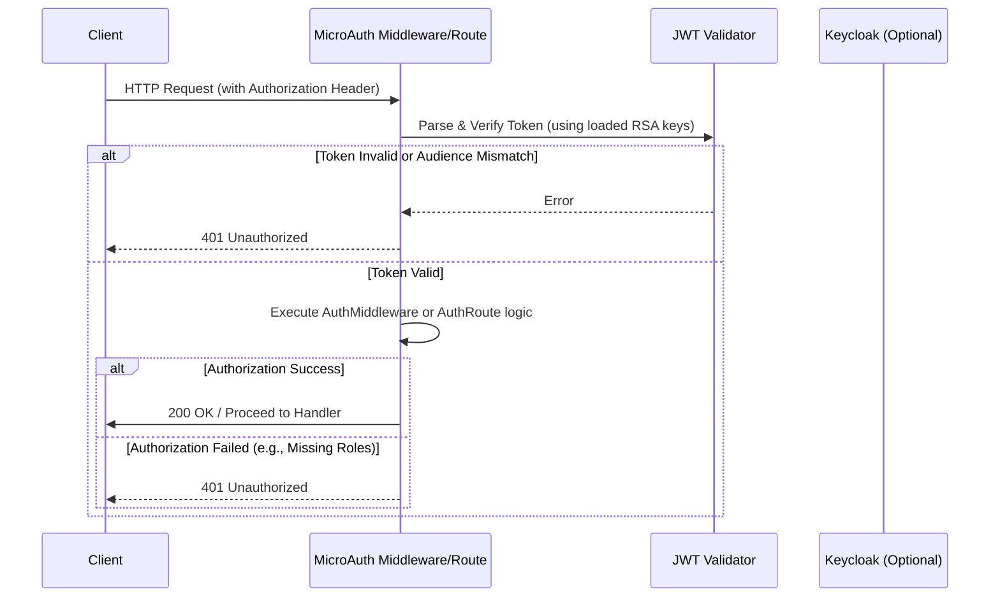
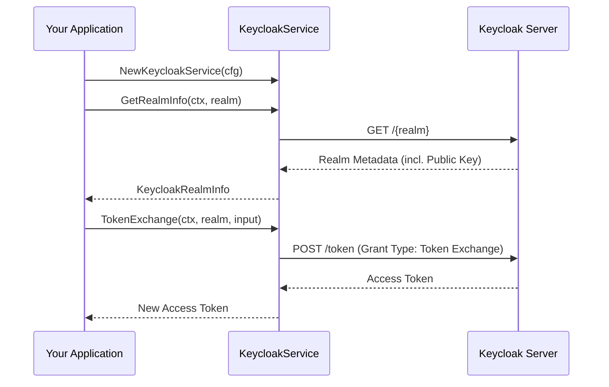

# MicroAuth

MicroAuth is a Go library designed to provide reusable authentication and authorization logic for web API projects using the `echo/v5` framework. It facilitates JWT verification, role-based access control (RBAC), and integration with Keycloak.

## System Purpose

The library provides standardized middleware and route-level authorization wrappers to ensure consistent security patterns across multiple microservices. It supports various public key retrieval methods (file, string, or Keycloak) and simplifies the process of validating JWTs and checking user roles/claims.

## Tech Stack & Dependencies

* **Language:** Go
* **Web Framework:** [echo/v5](https://github.com/labstack/echo)
* **JWT Library:** [golang-jwt/jwt/v5](https://github.com/golang-jwt/jwt)
* **Keycloak Integration:** Standard HTTP/JSON for OpenID Connect compatibility

## Key Workflows

### Authentication & Authorization Flow

The following diagram illustrates how a request is processed through the `AuthorizeMiddleware` or `AuthorizeRoute` functions.



### Keycloak Integration Workflow

When using Keycloak for key management or token exchange:



## Usage

### 1. Initialization

First, initialize the `Auth` struct and load your verification keys.

```go
auth := &microauth.Auth{
    Aud: "your-expected-audience",
    Store: myDataStore, // Optional: pass custom store for AuthRoute/AuthMiddleware
}

// Option A: Load from a string (environment variable)
err := auth.LoadVerificationKey(microauth.VerificationKeyOptions{
    KeySource: microauth.KeyString,
    KeyVal:    os.Getenv("PUBLIC_KEY"),
})

// Option B: Load from a file
err := auth.LoadVerificationKey(microauth.VerificationKeyOptions{
    KeySource: microauth.KeyFile,
    KeyVal:    "/path/to/public.pem",
})

// Option C: Load from Keycloak
err := auth.LoadVerificationKey(microauth.VerificationKeyOptions{
    KeySource: microauth.KeycloakUrl,
    KeyVal:    "https://keycloak.example.com",
})
```

### 2. Applying Middleware (Global or Group Level)

Use `AuthorizeMiddleware` to protect entire groups of routes. This validates the token and checks the `aud` claim.

```go
e := echo.New()
api := e.Group("/api/v1")

// All routes in this group require a valid Bearer token
api.Use(auth.AuthorizeMiddleware)

api.GET("/profile", handleProfile)
```

### 3. Route-Level Authorization (RBAC)

Use `AuthorizeRoute` to enforce specific roles for individual endpoints.

```go
// Only users with the 'admin' role can access this route
e.GET("/admin/dashboard", auth.AuthorizeRoute(adminHandler, microauth.ADMIN_ROLE))

// Using constants for roles (example)
const (
    PUBLIC = 0
    USER   = 1
    ADMIN  = 2
)

e.GET("/data", auth.AuthorizeRoute(dataHandler, USER, ADMIN))
```

### 4. Form-Based Authorization

If the token is passed via a form field named `authorization` instead of the `Authorization` header:

```go
e.POST("/login-check", auth.AuthorizeForm(checkHandler, microauth.USER))
```

### 5. Using Keycloak Service

For advanced flows like Token Exchange or Direct Grants:

```go
cfg := microauth.KeycloakConfig{
    KeycloakUrl: "https://keycloak.example.com",
}
ks := microauth.NewKeycloakService(cfg)

// Token Exchange
token, err := ks.TokenExchange(ctx, "my-realm", microauth.TokenExchangeInput{
    DelegateClientId: "my-client",
    DelegateClientSecret: "my-secret",
    UserAccessToken: "user-token",
    DownstreamAud: "target-audience",
})
```

## API Reference

### `Auth` Struct

The core engine for authentication.

| Field | Type | Description |
| :--- | :--- | :--- |
| `VerifyKeys` | `[]*rsa.PublicKey` | Slice of loaded RSA public keys for JWT verification. |
| `Aud` | `string` | The expected audience (`aud`) claim in the JWT. |
| `AuthRoute` | `AuthRouteFunction` | Custom logic function for route-level authorization. |
| `AuthMiddleware` | `AuthMiddlewareFunction` | Custom logic function for middleware-level authorization. |
| `Store` | `interface{}` | An arbitrary data store passed to custom auth functions. |

### Methods

#### `AuthorizeMiddleware(handler echo.HandlerFunc) echo.HandlerFunc`
Wraps an Echo handler to ensure the request contains a valid JWT with the correct audience.

#### `AuthorizeRoute(handler echo.HandlerFunc, roles ...int) echo.HandlerFunc`
Wraps an Echo handler to ensure the request contains a valid JWT and that the user possesses at least one of the required roles.

#### `LoadVerificationKey(options VerificationKeyOptions) error`
Loads a public key from one of the supported sources.

| Parameter | Type | Required? | Description |
| :--- | :--- | :--- | :--- |
| `options` | `VerificationKeyOptions` | Yes | Configuration specifying the source and value of the key. |

### `KeycloakService` Struct

Methods for interacting with Keycloak.

| Method | Description |
| :--- | :--- |
| `NewKeycloakService` | Constructor for `KeycloakService`. |
| `GetRealmInfo` | Fetches realm configuration including the public key. |
| `TokenExchange` | Performs an OAuth2 token exchange. |
| `DirectGrant` | Performs a password grant flow. |
| `ValidateToken` | Validates a specific JWT string using realm info. |

## Execution Commands

### Development

```bash
go build ./...
```

### Testing

```bash
go test -v ./...
```
